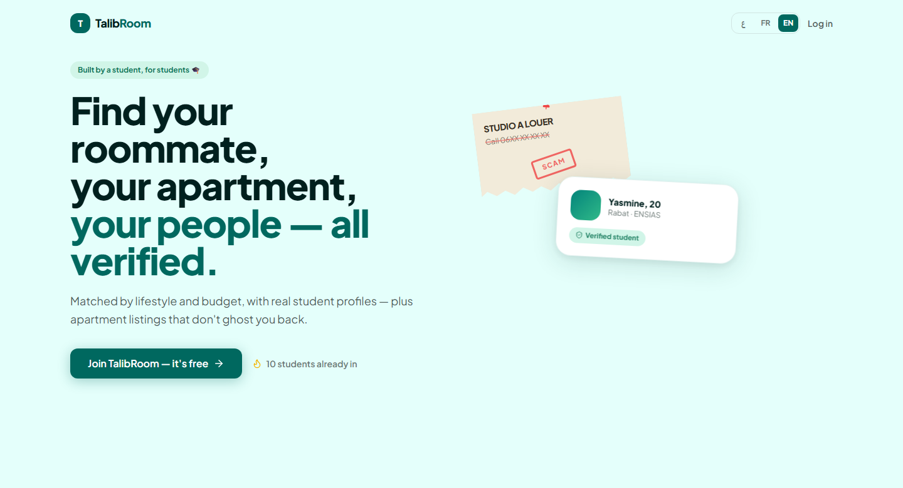

# TalibRoom

**Roommate matching, verified apartment listings, and student communities — built for university students in Morocco.**




## What it is

Most Moroccan students find housing through unmoderated Facebook groups and
campus flyers, with no way to verify a listing or a roommate is real.
TalibRoom replaces that with verified student profiles matched by lifestyle
and budget, real apartment listings, and city-based student communities —
the core product is free.

## Features

- **Roommate matching** — profile-based matching by city, university,
  budget, and lifestyle habits (sleep schedule, cleanliness, study style)
- **Apartment listings** — student and verified-realtor listings, filtered
  by city and gender-safety rules, with multi-image upload
- **Student communities** — city/university feeds, groups with group chat,
  and 1:1 messaging with read receipts and realtime delivery
- **Moderation** — report flow with an automatic-ban trigger on repeat
  reports, plus an admin review dashboard
- **Realtor accounts** — a separate account type with DB-level access
  restrictions (RLS), not just client-side checks
- **Referral growth loop** — every student gets a personal invite link;
  invites are tracked server-side and feed a signup counter
- **Full localization** — English, French, and Arabic, including RTL layout

## Tech stack

- **Frontend**: React 18, TypeScript, Vite, Tailwind CSS, Framer Motion,
  React Query, Zustand, React Router, react-i18next
- **Backend**: Supabase (Postgres, Row-Level Security, Realtime, Storage,
  Auth) — no separate API server; all access control is enforced at the
  database layer via RLS policies and `SECURITY DEFINER` functions
- **Schema**: [`supabase/migrations`](supabase/migrations) — 22 sequential,
  idempotent SQL migrations tracking the full schema history

## Architecture notes

Every table has row-level security policies scoping reads/writes to what a
given user (student, realtor, or admin) is actually allowed to touch —
enforced by Postgres itself, not just hidden in the client. Sensitive
mutations (banning a user, approving a premium request) go through
`SECURITY DEFINER` functions rather than direct table access. See
[`supabase/README.md`](supabase/README.md) for the full migration list.

## Getting started

```bash
npm install
cp .env.example .env   # add your Supabase project URL + anon key
npm run dev
```

Without Supabase credentials the app falls back to a local mock-data mode
for UI development.

## Project structure

```
src/
  components/    shared UI + layout (Sidebar, BottomNav, AppShell)
  pages/         one folder per route/feature
  lib/           Supabase client, i18n, API layer, feature flags
  store/         Zustand stores (auth, UI state)
  locales/       en / fr / ar translation files
supabase/
  migrations/    versioned SQL schema history
```
